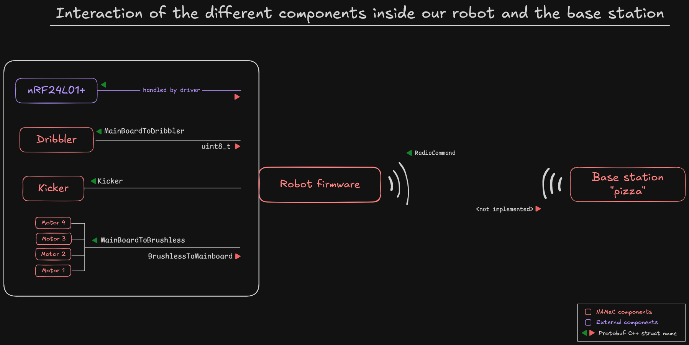

# The firmware of NAMeC
This documentation is here to help you have a high-level overview
of the different repositories and custom librairies used throughout
the different firmware.

## Components firmware

There are two separate embedded systems that communicate together, the robot's mainboard, and the base station.
Electronically, they are the same board, but they have different firmware

Inside of the robot, a total of 4 different CPUs have their own firmware, namely

- the robot's mainboard firmware
- the dribbler card
- each motor card
- the kicker card

Each of those have their own repository inside the NAMeC-Team organization on GitHub. But some librairies have been tailored for usage with our firmware, such as the library handling our radio module. You can find them in the [Repository links](./repos.md) chapter.
There is one chapter per component to describe parts of its codebase with the libraries it uses.

## Dev environment
Almost all of our repositories use the mBed RTOS. Briefly, you'll find in an mBed project 

- the source code inside `src/`
- one `.lib` file per library and its associated folder (that appears after running `mbed deploy`)
- a .mbed file describing the project
- a BUILD folder that contains the compiled code

This means you can find out which librairies a project uses by looking at the `.lib` files, which are merely links to Git repositories.

Only the dribbler, which uses STM32CubeIDE, is compiled differently. One day we'll move it to mBed (or something else, idk).

## Protobuf for message transmission
All of the messages transmitted are Protobuf packets (except for the radio module).
We use the [nanopb](https://github.com/nanopb/nanopb) library to serialize and deserialize them.

For those who don't know Protobuf, it's a way of easily transforming structured data into binary. We define the structure of our message in `.proto` files, and the Protobuf compiler's job is to transform those into structures or objects, in the language of our choice (in our case, C++).
The main advantage of Protobuf is that packet size is variable : fields set to 0 in a message will dissapear in the resulting binary transmitted.
Refer to the [Protobuf docs](https://protobuf.dev/) for more details on what it is and how it works.

All Protobuf messages can be found in the [`sensor-data-protocol`](https://github.com/NAMeC-SSL/data-protocol) internal library.

The following drawing shows how the base station, the robot firmware and its components communicate together.
All transmissions inside the robot are done via SPI, robot firmware is the master and initiates all communications, annotated with a green triangle, and component responses are
annotated with a red triangle.

Base station to robot communication is performed over radio, on a specific frequency assigned at the RoboCup

## Flashing
We use a JTag connector to flash the robot, motor, and dribbler firmware. The way you must plug in the cable is (to be described)
