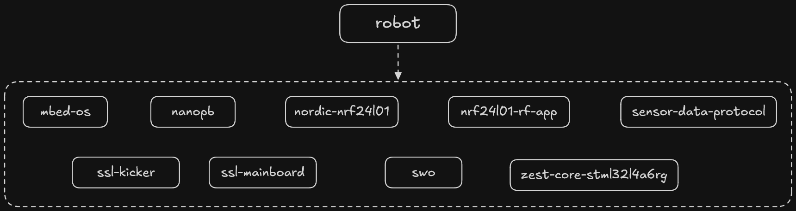
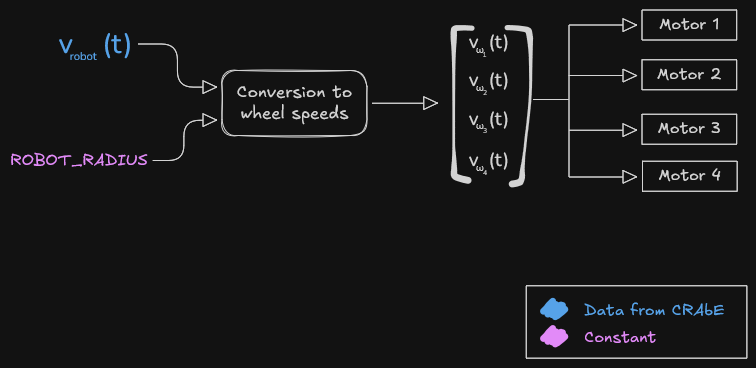

# Robot firmware
## Dependencies

## Characteristics & TL;DR
- Single core CPU - STM32L4A6RG
- Multitasking & multithreading provided by mbed-os
- Interrupt-based radio handling
- Everything processed in a mBed EventQueue
- Sends orders to all other components
- Stop motors after timeout, refreshed on command reception

## Main loop
The robot firmware uses a mBed [EventQueue](https://os.mbed.com/docs/mbed-os/v6.16/apis/eventqueue.html) across the code to perform tasks.
At startup, the robot just initializes necessary objects and runs the EventQueue loop indefinitely.

Two types of events are processed by the EventQueue's `dispatch_forever()` loop : radio packet reception
and periodic motor communication

Because the CPU used is single core, there is no possibility for race conditions or concurrent access to variables, except during an interrupt.

## Speed conversion
When a new command is received from the radio, robot firmware converts this robot frame speed into
four motor speeds. How these formulas were obtained couldn't be found across the TDPs,
but someone from the team has verified these formulas.

This conversion is performed in the `compute_motor_speed()` function, which reads the current command data parsed from the radio to change the target speeds for each motor.

These target speeds are transmitted with periodic events, described in the next section.