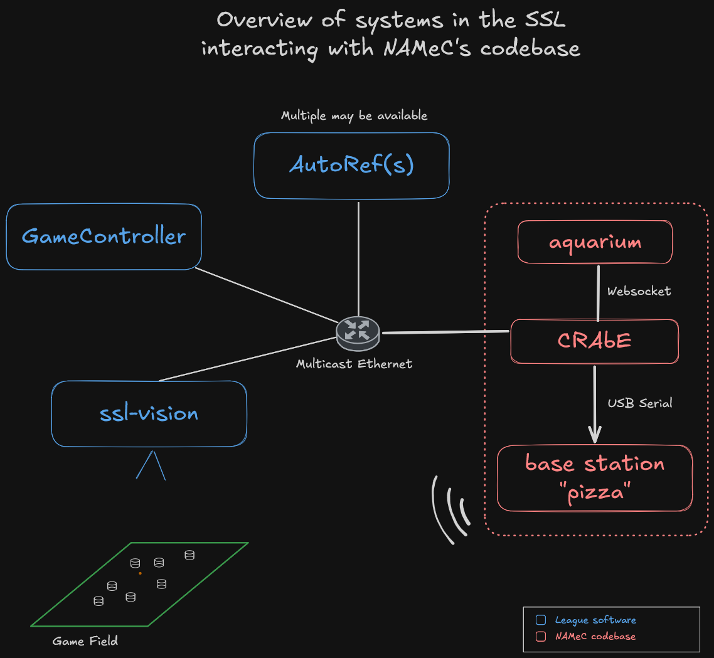

# Overview of systems in the SSL
For a match to be running properly, there are multiple software that run in parallel to provide information to the teams playing,
provided by the league, and launched by the organizers. Every team designs their codebase and software to participate in the league.
This chapter serves as a presentation of those systems and how they interact with the codebase of the team,
as well as understanding the codebase of NAMeC. You should read the [rulebook](https://ssl.robocup.org/rules/) if you haven't already, otherwise what we'll
be talking about won't make much sense !

The following diagram resumes how those systems interact with each other.

## SSL systems
There are software running in one computer sitting next to a field.
All of these softwares are already prepared & handled by the OC/TC (organizing committee/technical committee), and deliver data on a multicast IP address on a wired network.
Wi-Fi is not used in the competition to not interfere with radio communication.

### ssl-vision : Camera processing
There are cameras looking at the field during the match. Robot detection is color-based, each robot has a specific color pattern ontop of their shell,
defining their ID. Colored papers are provieded by the league once we enter the competition, to ensure everyone has the same material to be correctly identified by the vision system.

Software-wise, it provides raw detection data to everyone publishing two types of Protobuf packets :
- detection packets, where the robots and the ball are located
- geometry packets, describing the field and its dimensions

Detecton packets are sent depending on the camera FPS, but geometry packets are not sent as often.
You can find more information on the [official repo](https://github.com/RoboCup-SSL/ssl-vision) (documentation is hidden in the "Wiki" tab).

### Game Controller (GC) : half-automatic referee
Responsible for automatically determining the current state of the match, fouls and penalities, based on what the AutoRefs mention.
It also has a web interface to manually trigger state changes in the match, such as the timeout, which is started and stopped by the team needing the timeout.

Most of the time, matches run properly and there is nothing to do. But when a problem occurs (example: a false foul is called out by the AutoRefs),
we use the GUI to fix the current state of the game, halting the match if necessary.

### AutoRef(s) : automatic assistant referee
AutoRefs are software made by participating teams that implement all the rules to follow and calls out whenever a foul occurs or not. Today, only two teams provided AutoRef implementations, the Tigers Manheim and the ERForce. Both of those run on the same computer that runs ssl-vision and the GC. They submit their opinion to the GC, that decides what to do with it (either ignore them, or accept the foul, depending on the settings).

## NAMeC systems
All of these (except for the base station which is a separate physical component) are ran by us on a gaming laptop.
We run them independently, there's more information on how to run them in their respective repositories, this documentation
is just to give you a high-level view.

*note: the team decided in 2023 to name our software based on the theme of Spongebob Squarepants. that's why everything feels... aquatic*

### CRAbE : central decision software
The core of our decision system. It listens on the network to ssl-vision and the Game Controller and parses its informations.
All of the code that decides where our robots should do and the strategies are inside this software, coded in Rust.

### aquarium : viewer
Web pap that displays the field and information about what CRAbE has decided to do depending on the situation. It also
displays useful data, such as the current state of the match, and can be extended to show much more.

Connected to CRAbE with a Websocket, the page must be reloaded once CRAbE is running.

### base station (or "pizza") : radio emitting orders
External electronical board whose role is to process the speed orders received from CRAbE, and transmit them over radio.
It is exactly the same board as the one inside the robots.

Connected to the computer running the software with a data micro-USB cable (serial link).

## The role of humans in a match
During an official match, there are four roles that must be filled, namely

- The referee
- The assistant referee
- The Game Controller operator
- The Vision Expert

Two teams must provide two of their members to fill these roles. Usually, less experienced team gets the roles of assistant referee and vision expert.
Needless to say, both persons must know English well enough to communicate with the teams and other roles. 

### Referee & assistant referee
This is exactly the same as in football, except that you have software that already detects most of the rules, fouls, etc..
But when the software fails, or makes a mistake, the referee is responsible for taking a decision on what to do.
Being a referee is difficult, because you have to know the rules by heart, and be able to take decisions that might hinder the state of the match.
In doubt, referees often halt the match temporarily to discuss a complicated situation with a member of the OC or TC.

The assistant referee, on the other hand, is here to learn, help the referee out, and mostly just replace the ball wheen it goes out of bounds.

### Game Controller operator
Always sits behind the web interface of the GC and checks that everything runs without any problem.
The GC operator does not take decisions about the match, it only obeys to what the referee decides. When a problem occurs, if it is subject to interpretation, that person must notify the referee as quick as possible.

### Vision Expert
Color-based vision systems are very sensible to light changes, and ssl-vision is no different. The Vision Expert needs to check whether all robots are properly detected or not.
